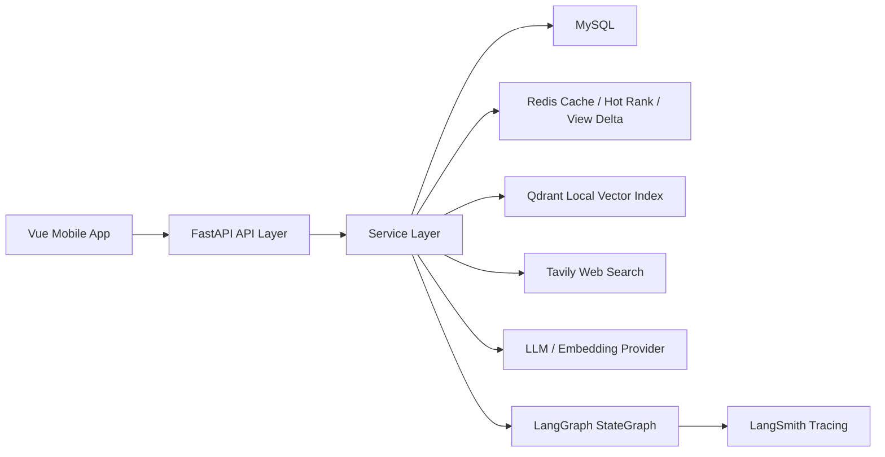

# AgentNews

AgentNews is a mobile-first news platform with an enterprise-style AI agent stack. The project combines a Vue 3 news app, a FastAPI backend, MySQL, Redis caching, Qdrant-based local vector retrieval, Tavily web search, LangGraph workflow orchestration, and LangSmith tracing.

## What The Project Focuses On

- Mobile news consumption: categories, home feed, detail page, favorites, history, profile.
- Enterprise-style performance: Redis cache-aside reads, hot ranking, view delta aggregation, graceful fallback.
- News agent capability: query analysis, retrieval planning, local lexical/vector hybrid retrieval, Tavily web search, verifier guardrails, workflow trace, evaluation loop.
- Interview-ready engineering: LangGraph StateGraph, LangSmith tracing, workflow graph export, evaluation datasets, response-level casebook.

## Key Highlights

- News business + AI agent in one product, rather than a standalone chat demo.
- Retrieval path evolves from lexical baseline to local hybrid retrieval and web search.
- Redis handles both high-frequency news reads and AI session state.
- Agent workflow is explicit, traceable, and evaluable.
- Session memory and session window management are separated into two clear layers.

## Tech Stack

- Frontend: Vue 3, Vite, Vant, Pinia, Axios
- Backend: FastAPI, SQLAlchemy, Pydantic
- Data: MySQL, Redis
- Agent/RAG: Qdrant, Tavily, LangGraph, LangSmith
- Packaging: Docker Compose, Nginx

## Current Architecture



## Quick Start

### 1. Backend

```powershell
cd D:\Code\Fastapi\AgentNews\backend
python -m venv .venv
.venv\Scripts\activate
pip install -r requirements.txt
uvicorn main:app --reload
```

### 2. Frontend

```powershell
cd D:\Code\Fastapi\AgentNews\frontend
npm install
npm run dev
```

### 3. Required `.env`

Use [`.env.example`](D:/Code/Fastapi/AgentNews/.env.example) as the template. At minimum you need:

- `MYSQL_URL`
- `REDIS_URL`
- `LLM_API_KEY`

Recommended for full agent capability:

- `TAVILY_API_KEY`
- `LANGSMITH_TRACING=true`
- `LANGSMITH_API_KEY`
- `LOCAL_RETRIEVAL_ENGINE=hybrid-ready`
- `ENABLE_VECTOR_RETRIEVAL=true`
- `EMBEDDING_BASE_URL`
- `EMBEDDING_API_KEY`
- `EMBEDDING_MODEL`
- `AI_SESSION_MEMORY_TTL_SECONDS`

## Local Verification

Run the repo-level dev check:

```powershell
cd D:\Code\Fastapi\AgentNews
powershell -ExecutionPolicy Bypass -File .\scripts\dev-check.ps1
```

This will:

- run targeted backend compile checks
- run backend smoke checks
- run backend integration checks
- run frontend production build

## Docker Compose

The repo now includes [docker-compose.yml](D:/Code/Fastapi/AgentNews/docker-compose.yml) plus backend/frontend Dockerfiles.

```powershell
cd D:\Code\Fastapi\AgentNews
docker compose up --build
```

Default ports:

- Frontend: `http://localhost:8080`
- Backend: `http://localhost:8000`
- MySQL: `localhost:3306`
- Redis: `localhost:6379`

Qdrant is currently packaged in local persistent mode through the backend service, which keeps development simple while preserving the retrieval architecture.

## Core API Entry Points

- `GET /health`
- `GET /api/news/categories`
- `GET /api/news/list`
- `GET /api/news/detail`
- `GET /api/news/hot`
- `GET /api/ai/status`
- `POST /api/ai/chat`
- `POST /api/ai/session/start`
- `GET /api/ai/session/{sessionId}`
- `DELETE /api/ai/session/{sessionId}`
- `GET /api/ai/workflow/graph`
- `POST /api/ai/eval/run`
- `POST /api/ai/eval/response/run`
- `GET /api/ai/index/status`
- `POST /api/ai/index/sync`

## Verification Checklist

If you want one shortest path to verify the repo locally, run:

```powershell
cd D:\Code\Fastapi\AgentNews
powershell -ExecutionPolicy Bypass -File .\scripts\dev-check.ps1
```

This covers:

- backend targeted compile
- backend smoke checks
- backend integration checks
- frontend production build

## Suggested Reading Order

- [docs/project-status-and-next-step.md](D:/Code/Fastapi/AgentNews/docs/project-status-and-next-step.md)
- [docs/architecture-overview.md](D:/Code/Fastapi/AgentNews/docs/architecture-overview.md)
- [docs/architecture-diagrams.md](D:/Code/Fastapi/AgentNews/docs/architecture-diagrams.md)
- [docs/documentation-map.md](D:/Code/Fastapi/AgentNews/docs/documentation-map.md)
- [docs/m4-ci-and-delivery-hardening.md](D:/Code/Fastapi/AgentNews/docs/m4-ci-and-delivery-hardening.md)
- [docs/m4-automated-smoke-tests.md](D:/Code/Fastapi/AgentNews/docs/m4-automated-smoke-tests.md)
- [docs/m4-integration-tests-and-final-showcase.md](D:/Code/Fastapi/AgentNews/docs/m4-integration-tests-and-final-showcase.md)
- [docs/m4-dev-check-and-demo-materials.md](D:/Code/Fastapi/AgentNews/docs/m4-dev-check-and-demo-materials.md)
- [docs/interview-prep-index.md](D:/Code/Fastapi/AgentNews/docs/interview-prep-index.md)
- [docs/demo-script.md](D:/Code/Fastapi/AgentNews/docs/demo-script.md)
- [docs/interview-storyline.md](D:/Code/Fastapi/AgentNews/docs/interview-storyline.md)
- [docs/github-showcase-guide.md](D:/Code/Fastapi/AgentNews/docs/github-showcase-guide.md)
- [docs/m3-session-memory-and-summary.md](D:/Code/Fastapi/AgentNews/docs/m3-session-memory-and-summary.md)
- [docs/m3-session-window-management.md](D:/Code/Fastapi/AgentNews/docs/m3-session-window-management.md)
- [docs/final-delivery-checklist.md](D:/Code/Fastapi/AgentNews/docs/final-delivery-checklist.md)
- [docs/testing-checklist.md](D:/Code/Fastapi/AgentNews/docs/testing-checklist.md)
- [docs/agent-method-evolution.md](D:/Code/Fastapi/AgentNews/docs/agent-method-evolution.md)

## Resume Summary

You can directly reuse the project experience draft in [docs/resume-project-experience.md](D:/Code/Fastapi/AgentNews/docs/resume-project-experience.md).
