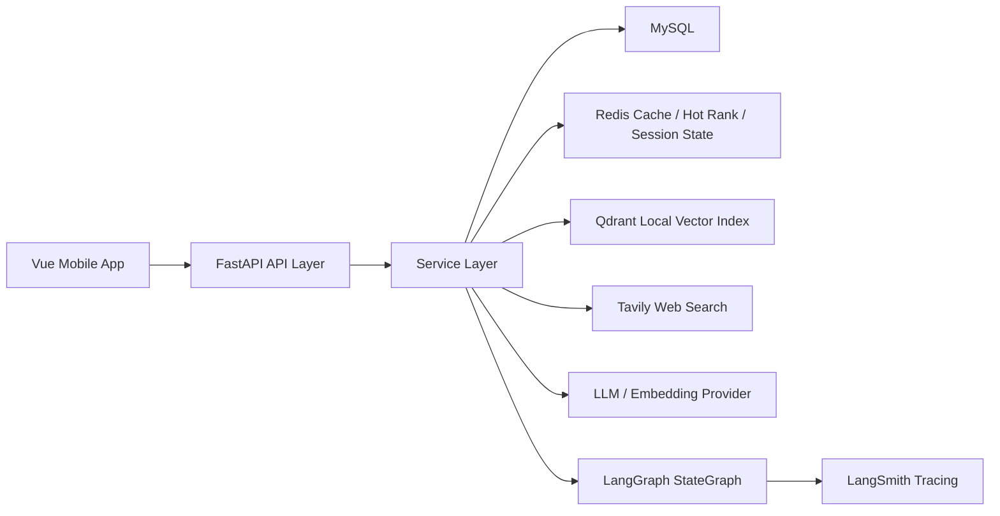
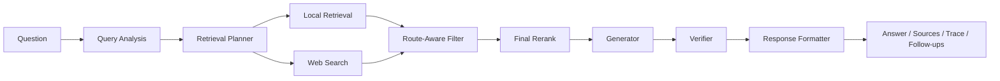
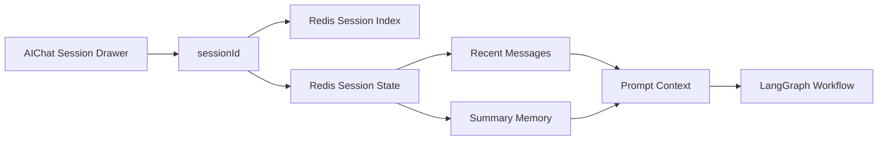
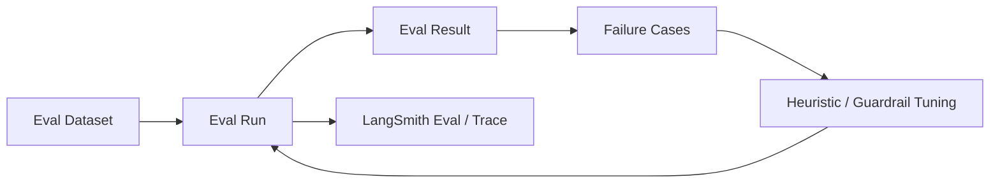

# AgentNews 架构图集

这份文档只做一件事：把项目里最值得展示的几张图单独收口，方便你后续截图、贴到 GitHub，或者面试时直接打开讲。

## 1. 系统总览图

适合：

- README
- GitHub 首页
- 面试开场

## 2. 新闻 Agent 工作流图

适合：

- 讲 Agent 结构
- 解释为什么不是自由 Agent

## 3. 会话与记忆图

适合：

- 讲 session memory
- 讲聊天窗口管理
- 解释“记忆”和“会话列表”的区别

## 4. 评测闭环图

适合：

- 讲为什么项目不是只会回答
- 讲调优闭环和失败样本沉淀

## 5. 使用建议

如果你后面只想挑 1 到 2 张图放到 GitHub 首页，优先用：

1. 系统总览图
2. 新闻 Agent 工作流图

如果是面试里细讲，再补：

3. 会话与记忆图
4. 评测闭环图
