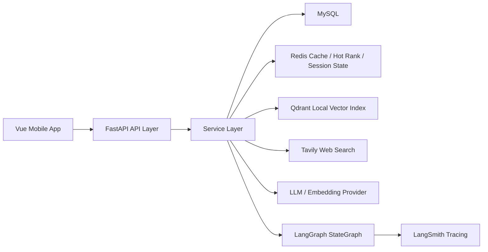
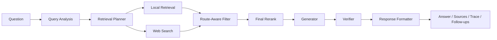
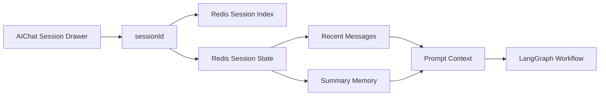
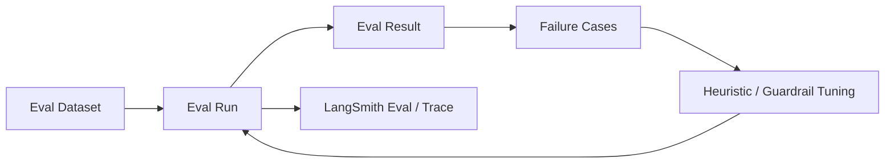

# AgentNews 鏋舵瀯鍥鹃泦

杩欎唤鏂囨。鍙仛涓€浠朵簨锛氭妸椤圭洰閲屾渶鍊煎緱灞曠ず鐨勫嚑寮犲浘鍗曠嫭鏀跺彛锛屾柟渚夸綘鍚庣画鎴浘銆佽创鍒?GitHub锛屾垨鑰呴潰璇曟椂鐩存帴鎵撳紑璁层€?
## 1. 绯荤粺鎬昏鍥?

閫傚悎锛?
- README
- GitHub 棣栭〉
- 闈㈣瘯寮€鍦?
## 2. 鏂伴椈 Agent 宸ヤ綔娴佸浘

閫傚悎锛?
- 璁?Agent 缁撴瀯
- 瑙ｉ噴涓轰粈涔堜笉鏄嚜鐢?Agent

## 3. 浼氳瘽涓庤蹇嗗浘

閫傚悎锛?
- 璁?session memory
- 璁茶亰澶╃獥鍙ｇ鐞?- 瑙ｉ噴鈥滆蹇嗏€濆拰鈥滀細璇濆垪琛ㄢ€濈殑鍖哄埆

## 4. 璇勬祴闂幆鍥?

閫傚悎锛?
- 璁蹭负浠€涔堥」鐩笉鏄彧浼氬洖绛?- 璁茶皟浼橀棴鐜拰澶辫触鏍锋湰娌夋穩

## 5. 浣跨敤寤鸿

濡傛灉浣犲悗闈㈠彧鎯虫寫 1 鍒?2 寮犲浘鏀惧埌 GitHub 棣栭〉锛屼紭鍏堢敤锛?
1. 绯荤粺鎬昏鍥?2. 鏂伴椈 Agent 宸ヤ綔娴佸浘

濡傛灉鏄潰璇曢噷缁嗚锛屽啀琛ワ細

3. 浼氳瘽涓庤蹇嗗浘
4. 璇勬祴闂幆鍥?
