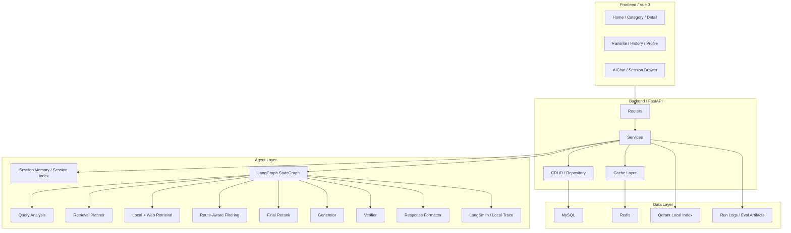
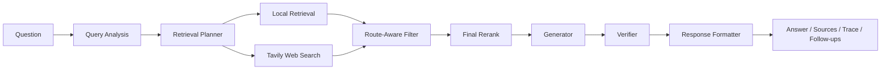
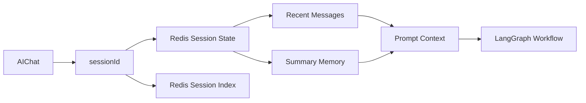

# AgentNews 架构总览

## 1. 项目定位

AgentNews 不是单纯的新闻站点，也不是单纯的聊天页面，而是一个围绕新闻场景构建的前后端一体化 AI 应用：

- 前端负责移动端新闻消费体验
- 后端负责业务 API、缓存、检索、工作流和观测
- 数据层同时覆盖结构化数据、缓存数据、向量索引和运行日志
- Agent 层负责把“新闻问答”做成可解释、可观测、可评测的系统

## 2. 分层架构

## 3. 新闻业务主链路

1. 前端请求分类、列表、详情或热榜
2. FastAPI Router 只负责参数和响应包装
3. `news_service` 负责缓存命中、数据库回源和视图聚合
4. Redis 承担公共读缓存、热榜、浏览量增量和回刷
5. MySQL 仍然是新闻和用户数据的权威来源

## 4. Agent 主链路

## 5. 会话与记忆链路

## 6. 为什么是这套结构

### 为什么后端要有 service 层

因为缓存、数据库、Qdrant、Tavily、LangGraph 都不能直接在 router 里拼接。Service 层把业务逻辑、检索策略和容错收口，才适合后续扩展。

### 为什么 Redis 不只做简单 get/set

新闻类系统的高频问题不是“能不能缓存”，而是：

- 列表和详情怎么做 cache-aside
- 浏览量这种高频写怎么聚合
- 热榜怎么维护
- Redis 故障后怎么回退

所以项目里的 Redis 同时承担公共读缓存、热榜、浏览量聚合和会话状态。

### 为什么本地检索不是一步到位只做向量检索

因为新闻问题既依赖实体词精确命中，也依赖语义召回，还依赖时间和分类过滤。项目先从 lexical baseline 做起，再升级到 Qdrant 和 hybrid retrieval，工程可解释性更强，也更适合面试讲述。

### 为什么工作流要用 LangGraph 风格节点

因为新闻问答最怕幻觉和不可解释。把链路拆成显式节点，才能：

- 知道每一步做了什么
- 把 verifier、filter、rerank 做成独立职责
- 对接 LangSmith tracing 和后续评测

## 7. 当前工程状态

已经完成：

- 移动端新闻前端体验升级
- MySQL + Redis 主链路稳定
- 热榜和浏览量增量回刷
- 本地 lexical 检索
- Tavily Web Search
- Qdrant 本地向量召回
- Local hybrid retrieval
- Retrieval planner / route-aware filter / final rerank
- Verifier / low-confidence fallback / no-evidence refusal
- Session memory / session window management
- LangGraph StateGraph
- LangSmith tracing
- workflow graph export
- planner baseline evaluation
- response-level evaluation

现在项目已经不是“概念方案”，而是一个可运行、可演示、可面试讲解的完整版本。
