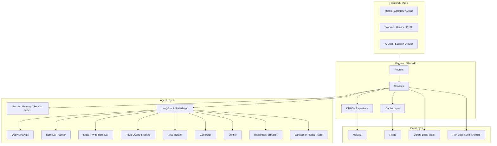
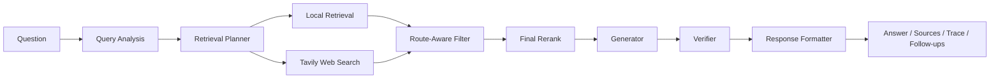
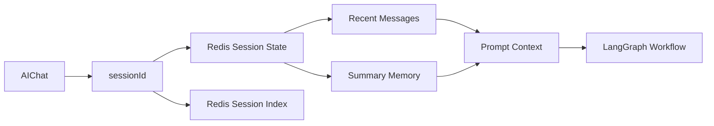

# AgentNews 鏋舵瀯鎬昏

## 1. 椤圭洰瀹氫綅

AgentNews 涓嶆槸鍗曠函鐨勬柊闂荤珯鐐癸紝涔熶笉鏄崟绾殑鑱婂ぉ椤甸潰锛岃€屾槸涓€涓洿缁曟柊闂诲満鏅瀯寤虹殑鍓嶅悗绔竴浣撳寲 AI 搴旂敤锛?
- 鍓嶇璐熻矗绉诲姩绔柊闂绘秷璐逛綋楠?- 鍚庣璐熻矗涓氬姟 API銆佺紦瀛樸€佹绱€佸伐浣滄祦鍜岃娴?- 鏁版嵁灞傚悓鏃惰鐩栫粨鏋勫寲鏁版嵁銆佺紦瀛樻暟鎹€佸悜閲忕储寮曞拰杩愯鏃ュ織
- Agent 灞傝礋璐ｆ妸鈥滄柊闂婚棶绛斺€濆仛鎴愬彲瑙ｉ噴銆佸彲瑙傛祴銆佸彲璇勬祴鐨勭郴缁?
## 2. 鍒嗗眰鏋舵瀯

## 3. 鏂伴椈涓氬姟涓婚摼璺?
1. 鍓嶇璇锋眰鍒嗙被銆佸垪琛ㄣ€佽鎯呮垨鐑
2. FastAPI Router 鍙礋璐ｅ弬鏁板拰鍝嶅簲鍖呰
3. `news_service` 璐熻矗缂撳瓨鍛戒腑銆佹暟鎹簱鍥炴簮鍜岃鍥捐仛鍚?4. Redis 鎵挎媴鍏叡璇荤紦瀛樸€佺儹姒溿€佹祻瑙堥噺澧為噺鍜屽洖鍒?5. MySQL 浠嶇劧鏄柊闂诲拰鐢ㄦ埛鏁版嵁鐨勬潈濞佹潵婧?
## 4. Agent 涓婚摼璺?

## 5. 浼氳瘽涓庤蹇嗛摼璺?

## 6. 涓轰粈涔堟槸杩欏缁撴瀯

### 涓轰粈涔堝悗绔鏈?service 灞?
鍥犱负缂撳瓨銆佹暟鎹簱銆丵drant銆乀avily銆丩angGraph 閮戒笉鑳界洿鎺ュ湪 router 閲屾嫾鎺ャ€係ervice 灞傛妸涓氬姟閫昏緫銆佹绱㈢瓥鐣ュ拰瀹归敊鏀跺彛锛屾墠閫傚悎鍚庣画鎵╁睍銆?
### 涓轰粈涔?Redis 涓嶅彧鍋氱畝鍗?get/set

鏂伴椈绫荤郴缁熺殑楂橀闂涓嶆槸鈥滆兘涓嶈兘缂撳瓨鈥濓紝鑰屾槸锛?
- 鍒楄〃鍜岃鎯呮€庝箞鍋?cache-aside
- 娴忚閲忚繖绉嶉珮棰戝啓鎬庝箞鑱氬悎
- 鐑鎬庝箞缁存姢
- Redis 鏁呴殰鍚庢€庝箞鍥為€€

鎵€浠ラ」鐩噷鐨?Redis 鍚屾椂鎵挎媴鍏叡璇荤紦瀛樸€佺儹姒溿€佹祻瑙堥噺鑱氬悎鍜屼細璇濈姸鎬併€?
### 涓轰粈涔堟湰鍦版绱笉鏄竴姝ュ埌浣嶅彧鍋氬悜閲忔绱?
鍥犱负鏂伴椈闂鏃緷璧栧疄浣撹瘝绮剧‘鍛戒腑锛屼篃渚濊禆璇箟鍙洖锛岃繕渚濊禆鏃堕棿鍜屽垎绫昏繃婊ゃ€傞」鐩厛浠?lexical baseline 鍋氳捣锛屽啀鍗囩骇鍒?Qdrant 鍜?hybrid retrieval锛屽伐绋嬪彲瑙ｉ噴鎬ф洿寮猴紝涔熸洿閫傚悎闈㈣瘯璁茶堪銆?
### 涓轰粈涔堝伐浣滄祦瑕佺敤 LangGraph 椋庢牸鑺傜偣

鍥犱负鏂伴椈闂瓟鏈€鎬曞够瑙夊拰涓嶅彲瑙ｉ噴銆傛妸閾捐矾鎷嗘垚鏄惧紡鑺傜偣锛屾墠鑳斤細

- 鐭ラ亾姣忎竴姝ュ仛浜嗕粈涔?- 鎶?verifier銆乫ilter銆乺erank 鍋氭垚鐙珛鑱岃矗
- 瀵规帴 LangSmith tracing 鍜屽悗缁瘎娴?
## 7. 褰撳墠宸ョ▼鐘舵€?
宸茬粡瀹屾垚锛?
- 绉诲姩绔柊闂诲墠绔綋楠屽崌绾?- MySQL + Redis 涓婚摼璺ǔ瀹?- 鐑鍜屾祻瑙堥噺澧為噺鍥炲埛
- 鏈湴 lexical 妫€绱?- Tavily Web Search
- Qdrant 鏈湴鍚戦噺鍙洖
- Local hybrid retrieval
- Retrieval planner / route-aware filter / final rerank
- Verifier / low-confidence fallback / no-evidence refusal
- Session memory / session window management
- LangGraph StateGraph
- LangSmith tracing
- workflow graph export
- planner baseline evaluation
- response-level evaluation

鐜板湪椤圭洰宸茬粡涓嶆槸鈥滄蹇垫柟妗堚€濓紝鑰屾槸涓€涓彲杩愯銆佸彲婕旂ず銆佸彲闈㈣瘯璁茶В鐨勫畬鏁寸増鏈€?
